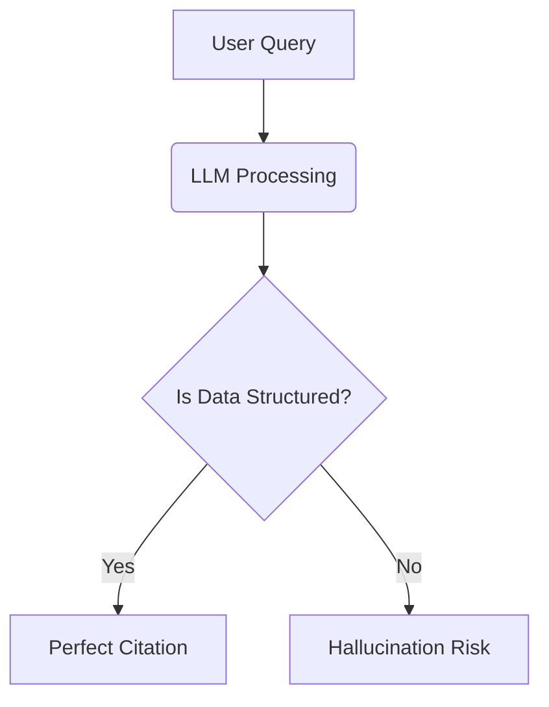

---

title: "The \"Diagram-as-Code\" Protocol: Optimizing Visual Content for Multimodal AI Retrieval"

description: "Unlock higher visibility in AI Overviews by using Diagram-as-Code. Learn how tools like Mermaid.js create deterministic, machine-readable visuals that guarantee accurate citation by multimodal models like GPT-4V and Gemini."

slug: "diagram-as-code-protocol-optimizing-visual-content-multimodal-ai-retrieval"

publishedAt: "2026-02-03"

updatedAt: "2026-02-03"

author:
  name: "Steakhouse Agent"
  url: "https://trysteakhouse.com"

tags:

  - "Generative Engine Optimization"

  - "Diagram-as-Code"

  - "Multimodal AI"

  - "Mermaid.js"

  - "Technical SEO"

  - "Content Automation"

  - "B2B SaaS Marketing"

  - "Visual Search Strategy"

faq:

  - question: "What is Diagram-as-Code and how does it help SEO?"

    answer: "Diagram-as-Code is the practice of creating visual charts using code (like Mermaid.js) instead of image files. It helps SEO and GEO because search engine crawlers and LLMs can read the text-based source code directly. This eliminates OCR errors, ensures the AI understands your logic perfectly, and increases the likelihood of your content being cited correctly in AI Overviews and answer engine results."

  - question: "Why are code-based diagrams better for AI Overviews than images?"

    answer: "AI Overviews rely on retrieving accurate facts quickly. Raster images (JPG/PNG) require complex vision processing that can misinterpret text or arrows, leading to hallucinations. Code-based diagrams are deterministic; the AI reads the code as plain text instructions, guaranteeing 100% accurate comprehension of the relationships and entities described, which makes the AI trust your content more as a source."

  - question: "Can Steakhouse Agent generate Mermaid diagrams automatically?"

    answer: "Yes, Steakhouse Agent is designed as a markdown-first content automation platform. It can interpret your brand's technical concepts or product workflows and automatically generate valid Mermaid.js syntax within the article body. This allows you to produce sophisticated, visually rich, and machine-readable documentation at scale without needing manual design work or coding knowledge."

  - question: "Does Diagram-as-Code work for traditional Google Image Search?"

    answer: "It depends on implementation. If your site renders the code into an SVG (Scalable Vector Graphic), Google indexes it as an image while still reading the text content inside. SVGs often rank very well in image search for technical diagrams because they are high-quality at any zoom level. However, the primary benefit is for the main web search and AI answer generation, rather than just the image tab."

  - question: "What is the best tool for implementing Diagram-as-Code on a blog?"

    answer: "Mermaid.js is widely considered the best standard for blogs and documentation because of its extensive support. It integrates natively with GitHub, GitLab, and many static site generators like Hugo or Jekyll. It is lightweight, uses simple syntax, and has a massive community, making it the safest bet for long-term compatibility and SEO performance in a markdown-based content workflow."

---

# The "Diagram-as-Code" Protocol: Optimizing Visual Content for Multimodal AI Retrieval

**Tl;Dr:** Diagram-as-Code replaces static raster images (PNGs/JPGs) with code-defined visuals (like Mermaid.js) to ensure multimodal AI models can read your content deterministically. Unlike standard images that rely on probabilistic OCR, code-based diagrams provide LLMs with raw text logic, guaranteeing 100% accurate interpretation, higher citation rates in AI Overviews, and superior Answer Engine Optimization (AEO).

## The Blind Spot in Multimodal AI

We are currently witnessing a massive migration in how information is indexed and retrieved. The shift from keyword-based search to intent-based generative answers is well underway. Marketing leaders and B2B SaaS founders are rushing to optimize their text for Large Language Models (LLMs) using Generative Engine Optimization (GEO) strategies. However, a critical blind spot remains in most content strategies: **visual data.**

For decades, we have locked our most valuable intellectual property—proprietary frameworks, workflow diagrams, and architectural charts—inside "dumb" raster formats like PNG, JPG, or flat PDFs. In the era of traditional SEO, this was acceptable provided you had a decent alt tag. In the era of Multimodal AI (models that can see, hear, and read simultaneously), this is a liability.

While models like GPT-4V, Gemini Pro Vision, and Claude 3 have impressive vision capabilities, they are not infallible. They rely on Optical Character Recognition (OCR) and visual embeddings to "guess" the relationship between boxes in a flowchart. This process is probabilistic, not deterministic. When an AI creates a summary of your product's unique workflow based on a blurry JPEG, it hallucinates. It misinterprets arrows. It misses nuances.

**The result?** Your brand is cited incorrectly, or worse, ignored entirely in favor of a competitor whose information structure is easier for the machine to parse.

By adopting a **Diagram-as-Code** protocol, you flip this dynamic. You stop feeding the AI pixels and start feeding it logic. This article outlines how moving to code-based visuals is the highest-leverage move you can make for AEO in 2026.

## What is the Diagram-as-Code Protocol?

**Diagram-as-Code** is the practice of generating diagrams, charts, and visual workflows using human-readable text code rather than manual drag-and-drop graphic design tools. Instead of drawing a box and saving it as a pixelated image, you write a script (using languages like **Mermaid.js**, **PlantUML**, or **Graphviz**) that renders the visual dynamically in the browser.

Because the source of the visual is plain text, search crawlers and LLMs do not need to "see" the image to understand it; they simply read the code. This ensures that the logic, hierarchy, and relationships within your visual content are ingested with zero loss of fidelity, serving as a perfect source of truth for answer engines.

## Why Deterministic Visuals Matter for GEO

In the context of Generative Engine Optimization (GEO), "determinism" is your greatest asset. When an LLM constructs an answer for a user query—such as "How does [Brand Name] handle data privacy?"—it retrieves information from its training data or active web search.

If your data privacy workflow is a PNG image, the LLM must:
1.  Download the image.
2.  Process it through a vision encoder.
3.  Attempt to read the text labels.
4.  Infer the directionality of arrows.
5.  Reconstruct the logic internally.

At every step, there is a margin for error. If the background contrast is low, or the layout is complex, the model may fail to extract the key entities. 

However, if that same workflow is defined in **Mermaid.js** within your markdown content, the LLM skips the vision processing entirely. It reads the syntax:

`User -->|Encrypts Data| System -->|Stores Key| Vault`

This is unambiguous. The AI knows exactly who does what. Consequently, the AI is far more likely to cite your documentation accurately in its response. In the battle for "Share of Model," the brand that is easiest to understand wins.

## Key Benefits of Code-Based Visuals

Transitioning to Diagram-as-Code offers structural advantages that go beyond just AI readability. It aligns perfectly with modern, Git-based content workflows.

### Benefit 1: Zero-Hallucination Indexing

The primary advantage is accuracy. When you provide the raw code of a diagram, you provide the semantic relationships explicitly. Search engines like Google are increasingly rendering JavaScript and parsing complex structures. By embedding diagrams as code, you provide structured data that functions similarly to Schema.org markup but for visual logic. This drastically reduces the chance of an AI Overview misrepresenting your product's architecture.

### Benefit 2: Living Documentation

In fast-moving B2B SaaS companies, product features change weekly. Updating a static image requires finding the original design file (Figma, Canva), editing it, exporting it, compressing it, and re-uploading it to the CMS. With Diagram-as-Code, the visual is defined directly in the markdown file. To update a step in the workflow, a developer or technical marketer simply edits a line of text in the Git repository. This ensures your public-facing visuals never drift from reality, a key signal for **E-E-A-T** (Trustworthiness).

### Benefit 3: Lightweight Performance

Core Web Vitals remain a ranking factor for traditional SEO. High-resolution diagrams can weigh megabytes, slowing down page loads on mobile. Code-based diagrams are rendered by the client's browser (or pre-rendered to SVG) and typically weigh only a few kilobytes. This creates a faster, cleaner user experience that search engines reward.

## How to Implement Diagram-as-Code for SEO

Implementing this protocol requires a shift in your content supply chain. It moves away from "design-first" to "content-first" visualization.

### Step 1: Choose a Markdown-Native Syntax

**Mermaid.js** is the industry standard for web-based Diagram-as-Code. It is supported natively by GitHub, GitLab, and many modern headless CMS platforms. It covers flowcharts, sequence diagrams, Gantt charts, and entity-relationship diagrams.

### Step 2: Embed Code Blocks in Your Content

Instead of an `` tag, you use a code block with a specific language identifier. For example:

When your blog renders, a JavaScript library converts this text into a crisp SVG graphic. However, the raw text remains in the DOM (Document Object Model), accessible to crawlers.

### Step 3: Use Semantic Labeling

Don't just label boxes "A" and "B". Use descriptive, keyword-rich IDs and labels within the diagram code. 

*   **Bad:** `A --> B`
*   **Good:** `Customer_Request -->|API Call| AI_Response_Engine`

This injects relevant keywords directly into the structural logic of the page, reinforcing your topical authority for those terms.

### Step 4: Automate with AI Agents

Writing Mermaid syntax manually can be tedious for non-technical writers. This is where platforms like **Steakhouse Agent** excel. Because Steakhouse is an AI-native content automation workflow, it can generate these diagrams automatically. When it writes an article about your "Data Ingestion Process," it doesn't just write paragraphs; it generates the valid Mermaid code to visualize that process, embedding it directly into the final markdown output. This automates the creation of high-value, GEO-optimized visuals at scale.

## Comparison: Raster Images vs. Diagram-as-Code

To understand the magnitude of this shift, compare the legacy approach with the modern protocol.

<table>
  <thead>
    <tr>
      <th>Criteria</th>
      <th>Raster Images (PNG/JPG)</th>
      <th>Diagram-as-Code (Mermaid/SVG)</th>
    </tr>
  </thead>
  <tbody>
    <tr>
      <td><strong>Data Source</strong></td>
      <td>Pixels (Unstructured)</td>
      <td>Text/Code (Structured)</td>
    </tr>
    <tr>
      <td><strong>AI Readability</strong></td>
      <td>Probabilistic (Vision/OCR required)</td>
      <td>Deterministic (Native text parsing)</td>
    </tr>
    <tr>
      <td><strong>Citation Accuracy</strong></td>
      <td>Variable (Prone to hallucination)</td>
      <td>High (Logic is explicit)</td>
    </tr>
    <tr>
      <td><strong>Maintainability</strong></td>
      <td>Low (Requires design software)</td>
      <td>High (Edit in text editor/Git)</td>
    </tr>
    <tr>
      <td><strong>File Size</strong></td>
      <td>Heavy (Raster data)</td>
      <td>Light (Vector instructions)</td>
    </tr>
  </tbody>
</table>

## Advanced Strategies: Semantic Injection

For teams ready to push the boundaries of AEO, Diagram-as-Code offers a unique vector for "Semantic Injection." This involves placing highly specific contextual data inside the diagram code that might not be rendered visually but is present for the crawler.

In Mermaid, you can add comments (using `%%`) or hidden classes. An advanced GEO strategy involves adding comments that define the entities in the diagram using their formal ontology names.

*Example:* `%% This node represents the Entity: Customer_Data_Platform (Wikidata Q12345)`

By doing this, you are effectively creating a mini Knowledge Graph within your article body. When an advanced crawler like Googlebot or an LLM scraper parses the page, it sees these explicit entity ties, significantly boosting the probability that your content is associated with those high-value topics. This is a level of optimization that is physically impossible with a flat PNG image.

## Common Mistakes to Avoid

While powerful, this protocol requires discipline. Avoid these common implementation errors.

*   **Mistake 1 – Relying on Screenshots of Code:** Do not take a screenshot of your Mermaid preview and upload it as a JPG. This defeats the entire purpose. The code must be rendered live or embedded as SVG text so the bot can read the source.
*   **Mistake 2 – Over-Complicating the Graph:** LLMs are smart, but infinite complexity can confuse them. Keep diagrams focused on a single concept or flow. If a process is too big, break it into sub-diagrams (chunking), which also aids in passage-level indexing.
*   **Mistake 3 – Ignoring Fallbacks:** While rare, some browsers or RSS readers may not execute the JavaScript needed to render Mermaid. Always ensure your CMS has a graceful fallback or that your content explains the diagram in the surrounding text.
*   **Mistake 4 – Forgetting Accessibility:** While code is text, screen readers for visually impaired users navigate these differently. Ensure you provide a text summary or `aria-label` describing the diagram's outcome, ensuring inclusivity alongside SEO.

## Integrating with the Steakhouse Workflow

The transition to Diagram-as-Code is not just a technical upgrade; it is a workflow upgrade. It moves marketing teams away from disjointed asset creation toward a unified, "Everything-as-Code" philosophy.

At **Steakhouse Agent**, we built our platform on this exact premise. We recognized that for B2B SaaS companies to dominate AI search, their content ecosystem needs to be as structured and machine-readable as their software products. Steakhouse doesn't just write text; it structures knowledge. By treating your blog as a repository of structured markdown and code-based visuals, we ensure that platforms like ChatGPT, Perplexity, and Google Gemini have the easiest possible time digesting your expertise.

When your content is frictionless for the machine, the machine rewards you with visibility. In the generative era, being the easiest to read is synonymous with being the best answer.

## Conclusion

The "Diagram-as-Code" protocol is more than a developer convenience; it is a strategic asset for search visibility in the age of AI. By converting your visual IP into machine-readable text, you immunize your brand against AI hallucinations and secure your place in the answers of tomorrow. Start by auditing your top-performing technical articles and converting their static images into dynamic Mermaid blocks. The future of search is not just about what you write, but how effectively you help the AI see what you mean.