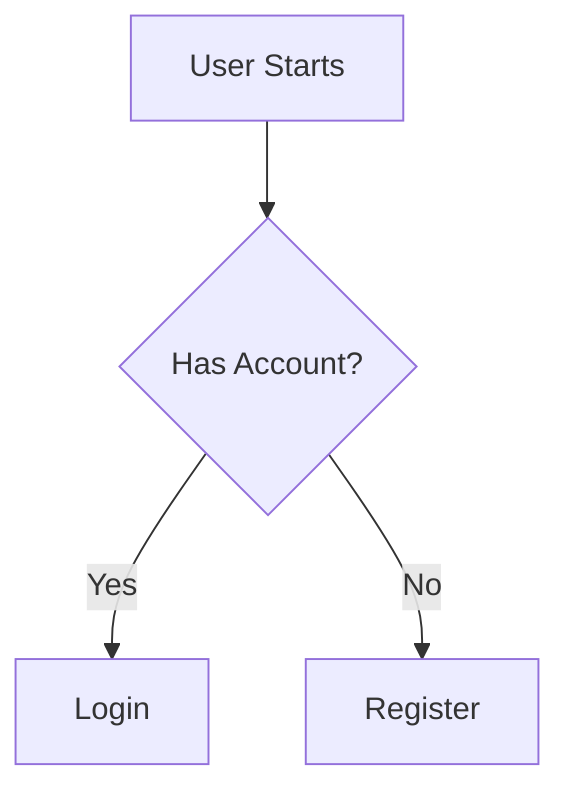

---

title: "The \"Render-Ready\" Standard: Encoding Data Visualizations as Text Syntax for Superior LLM Comprehension"

description: "Stop feeding AI static images. Learn why encoding charts as Mermaid.js or JSON syntax creates 'Render-Ready' content that boosts LLM comprehension, citation rates, and GEO performance."

slug: "render-ready-standard-encoding-data-visualizations-text-syntax-llm-comprehension"

publishedAt: "2026-02-22"

updatedAt: "2026-02-22"

author:
  name: "Steakhouse Agent"
  url: "https://trysteakhouse.com"

tags:

  - "Generative Engine Optimization"

  - "Data Visualization"

  - "Mermaid.js"

  - "SEO"

  - "AEO"

  - "Content Automation"

  - "Structured Data"

  - "B2B SaaS"

faq:

  - question: "Why is text syntax better than PNGs for Generative Engine Optimization?"

    answer: "Text syntax, such as Mermaid.js or raw JSON, is native to Large Language Models (LLMs). Unlike static PNGs, which require error-prone optical character recognition (OCR) or vision processing, text syntax allows the AI to parse the exact data points, relationships, and labels directly as tokens. This eliminates hallucination risks and significantly increases the probability that the AI will cite your data as a trustworthy source in its answer, as it does not have to 'guess' the content of the image."

  - question: "What is the 'Render-Ready' standard in content marketing?"

    answer: "The 'Render-Ready' standard is a technical content strategy where visual assets—like charts, graphs, and flowcharts—are embedded as executable code blocks (e.g., Mermaid, Vega-Lite) rather than rasterized images. This approach ensures that the content is human-readable when rendered by a browser via JavaScript libraries, but remains machine-readable as structured text for search crawlers and AI answer engines. It is the gold standard for optimizing for both user experience and search visibility simultaneously."

  - question: "Does Google index Mermaid.js diagrams effectively?"

    answer: "Yes, Google and other modern search engines are increasingly adept at parsing code blocks within Markdown and HTML. Because Mermaid.js is fundamentally text-based, the keywords, labels, and hierarchical relationships within the diagram are indexed just like standard paragraph text. This provides semantic density that a static image file lacks (even with alt text), thereby improving topical authority and relevance for technical queries and ensuring the entities within the chart are understood by the search graph."

  - question: "How does embedding data as code affect page load speed?"

    answer: "Embedding data as code significantly improves page performance. A complex flowchart rendered via a lightweight JavaScript library like Mermaid often weighs only a few kilobytes, whereas a high-resolution PNG or JPEG file conveying the same information can differ by orders of magnitude in file size. By reducing the reliance on heavy image assets, you decrease bandwidth usage and improve Core Web Vitals (specifically Largest Contentful Paint), which is a ranking factor for traditional SEO and a user experience metric favored by AI discovery algorithms."

  - question: "Can non-developers implement Render-Ready visualizations?"

    answer: "Absolutely. While the underlying technology is code-based, modern AI content automation tools—like Steakhouse Agent—can automatically generate the necessary syntax from plain English prompts or raw data sets. Marketers do not need to write the code manually; they simply need to use platforms that support Markdown-first publishing workflows to ensure the syntax is preserved. This democratizes the ability to publish high-fidelity, GEO-optimized data visualizations without requiring a computer science degree."

---

# The "Render-Ready" Standard: Encoding Data Visualizations as Text Syntax for Superior LLM Comprehension

**Tl;Dr:** The "Render-Ready" Standard replaces static image charts with code-based syntax (like Mermaid.js or JSON) to maximize AI comprehension. Because LLMs process text natively but struggle with image interpretation, embedding visuals as code ensures 100% data accuracy, reduces hallucinations, and significantly increases the likelihood of your brand being cited in AI Overviews and answer engine results.

## Why Your Charts Are Invisible to AI

For decades, content marketers have relied on a simple, established workflow: create a chart in Excel, Canva, or Figma, export it as a high-resolution PNG or JPEG, and paste it into a blog post. For human readers, this works perfectly. The visual is engaging, colorful, and breaks up the wall of text. However, for the new generation of search—Generative Engine Optimization (GEO) and Answer Engine Optimization (AEO)—this process is fundamentally broken.

In the era of AI-driven search, your content has two distinct audiences: the human user and the Large Language Model (LLM) that acts as the gatekeeper. When a crawler like Googlebot or an LLM like GPT-4o encounters a PNG, it faces a "black box." To understand the content, it must rely on "Vision" capabilities or OCR (Optical Character Recognition) to guess what the image contains. This process is computationally expensive, slow, and prone to error.

It is estimated that a significant percentage of complex data trapped in static images is either ignored or hallucinated by LLMs when crawling web content. If the AI cannot confidently read the data in your chart, it will not use that data to construct an answer. Instead, it will bypass your content in favor of a text-based source it can understand—likely your competitor who wrote out the statistics in plain text or structured data.

This article outlines the shift to the **"Render-Ready" Standard**: a method of encoding visualizations as text syntax to ensure your data is readable, indexable, and citable by the machines that now control discovery.

## The Pixel Problem: Why Static Images Fail in the Age of AI

To understand why the Render-Ready standard is necessary, we must first understand how LLMs process information. LLMs are token prediction engines. They thrive on text. When you feed an LLM a string of text, it understands the semantic relationships, the entities, and the logic with high precision.

When you feed an LLM an image, the process changes. It must first convert that image into a description (image-to-text) before it can reason about it. This conversion layer is where the signal loss happens.

### The OCR Bottleneck
Optical Character Recognition has improved, but it is far from perfect, especially with complex charts. Axis labels often get truncated, legends are misinterpreted, and subtle trend lines are lost. For a B2B SaaS company publishing a quadrant chart comparing software features, a misread by an AI could mean your product is categorized incorrectly or your key differentiator is missed entirely.

### The Hallucination Risk
When an AI is unsure about the data in an image, it may hallucinate—fabricate information to fill the gaps. If your chart shows a 20% growth rate but the image is slightly blurry or the font is non-standard, the AI might read it as 2% or 200%, or simply invent a number that fits the context of the surrounding text. In the world of Answer Engine Optimization, accuracy is trust. If an AI cannot verify your data, it will not cite you.

## Decoding the "Render-Ready" Philosophy

The Render-Ready philosophy posits that **content should be stored as code and rendered as visuals.** 

Instead of saving a flowchart as `process.png`, you save it as a block of text using a syntax like Mermaid.js, Vega-Lite, or even raw JSON structures. When a human visits your blog, a lightweight JavaScript library runs in the browser, parsing that text and drawing a beautiful, interactive SVG chart instantly. The user sees a visual.

However, when a search bot or an LLM visits the page, it sees the raw code. It sees the text. It sees the exact data points, the labels, and the relationships defined in clear, unambiguous syntax.

### The Dual-State Asset
This creates a "Dual-State Asset":
1.  **For Humans:** A crisp, scalable vector graphic that looks professional.
2.  **For Machines:** A structured data object that can be parsed with 100% accuracy without vision processing.

This is the essence of Generative Engine Optimization. You are optimizing the signal-to-noise ratio for the generative engine.

## The Technical Advantage: Mermaid.js and JSON as SEO Superweapons

Let's look at why specific syntaxes like Mermaid.js are becoming the standard for technical content marketing.

### Token Efficiency and Comprehension
Consider a flowchart describing a software integration workflow. As an image, this is a grid of pixels. As Mermaid syntax, it looks like this:

To an LLM, this is pure gold. It explicitly states that "User Starts" leads to "Has Account?". There is no ambiguity. The relationship is defined by the arrow `-->`. The AI does not need to visually trace a line from box A to box B; the code tells it exactly what the relationship is.

When an AI Overview (like those in Google Search) tries to answer the question "How does the login workflow work?", it can ingest this text block and generate a perfectly accurate summary. If you had used an image, the AI might have missed the "No" branch entirely.

### Semantic Density and Indexing
Search engines index text. When you embed a chart as code, every label in that chart becomes indexable content. If your chart includes keywords like "API Gateway," "JSON-LD," and "Schema Markup," those keywords are now part of the page's textual payload. In a PNG, those keywords are trapped in pixels, invisible to standard crawlers unless you write extensive alt text (which rarely captures the full complexity of a chart).

By using the Render-Ready standard, you are effectively increasing the semantic density of your page. You are giving Google and Bing more relevant keywords and entities to associate with your URL, which directly contributes to higher rankings in traditional search and better visibility in AI answers.

## Generative Engine Optimization (GEO) Mechanics

GEO is about optimizing content for the specific behaviors of generative models. One of the core principles of GEO is **Citation Authority**. LLMs prefer to cite sources that provide structured, verifiable facts.

When an LLM parses a blog post to generate an answer, it assigns confidence scores to different pieces of information. Text-based data has a higher confidence score than image-derived data because it requires less interpretation. 

### The Citation Loop
1.  **Input:** The user asks a complex question about SaaS metrics.
2.  **Retrieval:** The AI searches its index or the live web for answers.
3.  **Parsing:** It finds two articles. Article A has a PNG chart. Article B has a JSON data table or Mermaid chart.
4.  **Selection:** The AI parses Article B's data immediately and accurately. It struggles with Article A.
5.  **Output:** The AI constructs an answer using Article B's data and cites Article B as the source.

For B2B SaaS brands, this is the difference between being the default answer and being invisible. Tools like **Steakhouse Agent** are built specifically to capitalize on this mechanic by ensuring that every piece of content generated includes these structured data signals.

## How to Implement Render-Ready Visualizations

Implementing this standard requires a shift in your content management system (CMS) and workflow. You need a "Markdown-First" approach.

### 1. The Markdown Workflow
Most modern developer-focused blogs (using Jekyll, Hugo, Gatsby, or Next.js) support Markdown. Markdown allows you to embed code blocks easily. You simply need to ensure your blog template includes the necessary JavaScript libraries (like `mermaid.min.js`) to render these blocks on the client side.

### 2. Choosing the Right Syntax
*   **Mermaid.js:** Best for flowcharts, sequence diagrams, Gantt charts, and simple pie/bar charts. It is highly readable and widely supported.
*   **Vega-Lite / JSON:** Best for complex statistical data, scatter plots, and interactive visualizations. This is essentially raw JSON data that describes a chart.
*   **ASCII Tables:** For simple data comparisons, even a well-formatted Markdown table is superior to an image of a table.

### 3. Automating the Process
Manually writing Mermaid syntax can be tedious for non-technical marketers. This is where AI content automation tools come in. Platforms like Steakhouse Agent allow you to input your raw data or a description of the process, and the AI agent generates the correct Mermaid syntax automatically. It embeds this syntax directly into the markdown file it creates, ensuring that your published article is Render-Ready from day one.

## The Role of Automation in Structured Content

Scaling this approach manually is difficult. Asking a content writer to learn JSON syntax or graph theory is a bottleneck. This is why **AI-native content automation** is becoming essential for B2B growth.

Software like Steakhouse Agent acts as a bridge. It takes your brand's positioning documents, product manuals, and raw data, and synthesizes them into long-form articles. Crucially, it doesn't just write paragraphs; it structures the data. It identifies opportunities to insert a flowchart and generates the code for it. It identifies a statistical comparison and formats it as a markdown table.

This automation ensures that every article you publish adheres to the Render-Ready standard without adding friction to your marketing team's workflow. It turns your blog into a repository of structured data that search engines love.

## Future-Proofing for Agentic Search

We are moving toward an era of "Agentic Search," where autonomous AI agents perform tasks on behalf of users. These agents will not "read" articles; they will query them. They will look for structured data that they can ingest into their own context windows to make decisions.

If an AI agent is tasked with "Find the best GEO software for B2B SaaS," it will look for feature comparison tables. If your comparison table is a PNG, the agent might skip it. If it is a structured text block, the agent can ingest the features, pricing, and capabilities of your software and recommend it to the user.

By adopting the Render-Ready standard today, you are future-proofing your content for a web that is increasingly read by machines, not just people. You are ensuring that your data remains accessible, accurate, and influential, regardless of the interface used to access it.

## Conclusion

The transition from static images to text-based syntax for data visualization is not just a technical tweak; it is a strategic imperative for modern SEO and AEO. The "Render-Ready" standard ensures that your valuable data is not lost in translation.

By encoding your charts, graphs, and workflows as Mermaid.js or JSON, you provide Large Language Models with the native tongue they speak best: text. You eliminate the risks of OCR errors and hallucinations, boost your page load speeds, and dramatically increase your chances of being cited in AI Overviews.

For B2B SaaS leaders, the path forward is clear. Stop publishing dead pixels. Start publishing living code. Use automation tools like Steakhouse Agent to scale this process, and turn your content marketing into a high-fidelity data stream that dominates the generative search landscape.