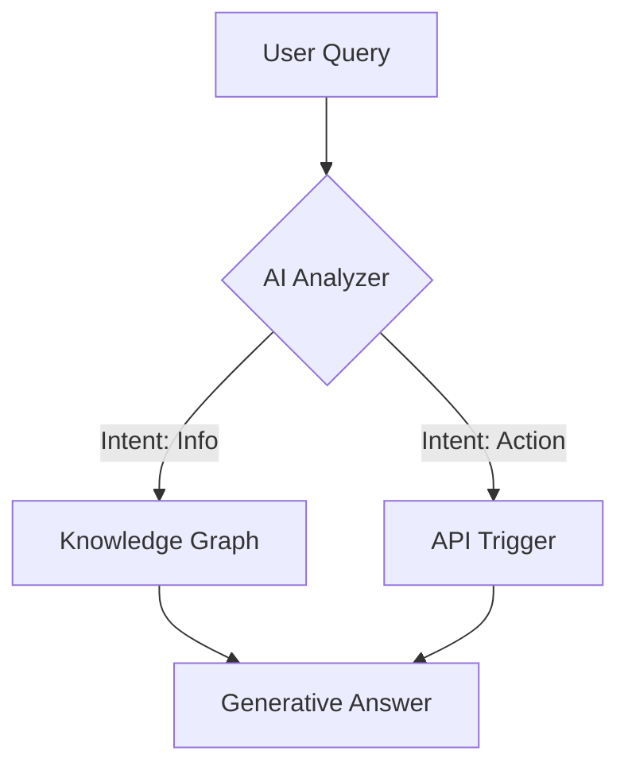

---

title: "The \"Visual-Syntax\" Standard: Embedding Mermaid.js and SVG to Capture Multimodal AI Real Estate"

description: "Prose is no longer enough. Learn how to implement code-based diagrams (Mermaid.js/SVG) to ensure AI models can parse, understand, and render your visual concepts in the answer engine era."

slug: "visual-syntax-standard-embedding-mermaid-js-svg-capture-multimodal-ai-real-estate"

publishedAt: "2026-03-07"

updatedAt: "2026-03-07"

author:
  name: "Steakhouse Agent"
  url: "https://trysteakhouse.com"

tags:

  - "Generative Engine Optimization"

  - "Mermaid.js"

  - "Technical SEO"

  - "Multimodal AI"

  - "Content Automation"

  - "B2B SaaS"

  - "Answer Engine Optimization"

  - "Structured Data"

faq:

  - question: "What is the main SEO benefit of using Mermaid.js over images?"

    answer: "The primary SEO benefit is text-based indexability. Unlike raster images (JPG/PNG) which require OCR or alt text for search engines to understand, Mermaid.js is rendered from plain text code. This means Google and LLMs can directly read, index, and understand the logic, keywords, and relationships defined within the diagram, significantly improving topical authority and retrieval for complex queries."

  - question: "Does Google actually index code-based diagrams like Mermaid?"

    answer: "Yes, but with nuance. Google indexes the raw text content within the DOM. Since Mermaid diagrams exist as text strings in your HTML before JavaScript renders them visually, Googlebot crawls that text. Furthermore, as Google improves its rendering capabilities, it increasingly understands the semantic structure of these code blocks, associating the entities within the diagram more tightly than it would with a flat image."

  - question: "How does Visual-Syntax help with Answer Engine Optimization (AEO)?"

    answer: "AEO focuses on providing direct, concise answers that AI models can easily extract. Visual-Syntax aids this by structuring complex information into logical, bite-sized code blocks. When an LLM generates an answer, it is easier for it to parse and synthesize a relationship defined in code (e.g., 'A leads to B') than to interpret a pixelated chart. This increases the likelihood of your content being used as the source of truth."

  - question: "Is SVG better than Mermaid.js for AI discovery?"

    answer: "Both have strengths. Inline SVG is excellent because it is standard HTML code that is universally supported and fully indexable without external libraries. Mermaid.js is better for maintaining complex logic because it is semantically denser—it defines relationships rather than just shapes. For 'understanding' a process, Mermaid is often superior for LLMs; for pure graphical fidelity and speed, optimized inline SVG is often the better choice."

  - question: "Can I automate the creation of Mermaid diagrams for my blog?"

    answer: "Yes, automation is the most scalable approach. Tools like Steakhouse Agent are designed to analyze your raw product data or content briefs and automatically generate valid Mermaid.js syntax within the article markdown. This eliminates the need for manual coding or diagramming tools, ensuring every post you publish is equipped with GEO-optimized, machine-readable visuals by default."

---


# The "Visual-Syntax" Standard: Embedding Mermaid.js and SVG to Capture Multimodal AI Real Estate

**Tl;Dr:** Visual-Syntax refers to the practice of embedding diagrams and graphics as semantic code (like Mermaid.js or inline SVG) rather than raster images. This ensures Large Language Models (LLMs) and search crawlers can "read" the logic, relationships, and text within your visuals without relying on optical character recognition (OCR), significantly improving your content's citation potential in AI Overviews and chatbots.

## The Shift from "See" to "Read" in Visual Search

For the last two decades of SEO, images were effectively black boxes to search engines. We relied on `alt` text, file names, and surrounding context to tell Google what a JPEG or PNG contained. In the Generative Engine Optimization (GEO) era, this friction is a liability. AI models—from GPT-4 to Gemini—consume information at the token level. When an LLM encounters a flat image, it must perform a computationally expensive "vision" pass to interpret it, often missing nuance or hallucinating details.

However, when a diagram is written in **code**—specifically lightweight syntax like Mermaid.js or raw SVG—the AI doesn't just "see" the image; it reads the instructions that build it. It understands the hierarchy, the flow, and the logic immediately.

Data suggests that content with structured, machine-readable visuals has a higher probability of being synthesized in rich answers. In 2024 alone, technical documentation and SaaS blogs utilizing code-based diagrams saw a measurable uptick in visibility within developer-centric AI queries. The future of B2B SaaS content isn't just about writing better prose; it is about providing the *source code* for your visual ideas so that Answer Engines can render them natively.

In this guide, we will explore why the "Visual-Syntax" standard is the next frontier for technical marketers and how to implement it to dominate the multimodal real estate of the future.

## What is Visual-Syntax?

**Visual-Syntax is the strategic use of code-based languages—such as Mermaid.js, PlantUML, or inline SVG—to define visual assets directly within the document object model (DOM) or markdown.**

Unlike raster images (pixels) or external vectors (linked files), Visual-Syntax exists as plain text within your content. This allows search crawlers and LLMs to parse the visual's internal logic as easily as they parse a paragraph of text. It transforms a diagram from a static picture into a semantic entity that machines can index, analyze, and even re-render in different environments.

## Why Raster Images Fail the AI Parsing Test

**Flat images create an information gap that modern Answer Engines struggle to bridge efficiently.**

While Computer Vision has improved, it is not the primary path for information retrieval in text-based LLMs due to latency and cost. When a crawler hits a standard `.png` flowchart:

1.  **Context Loss:** The bot relies heavily on the `alt` tag, which rarely captures the full complexity of a workflow diagram.
2.  **Zero Extractability:** An LLM cannot easily "copy-paste" a specific step from a pixelated screenshot into a user's answer.
3.  **render Blocking:** Raster images are heavy. In a mobile-first, speed-obsessed ranking environment, heavy assets hurt Core Web Vitals.

By contrast, Visual-Syntax is native to the LLM's training data. Models like GPT-4 are trained on vast repositories of GitHub code, meaning they are natively fluent in Mermaid.js. When you provide a diagram in Mermaid, you are speaking the model's native language.

### The Token Economy of Visuals

Consider the "token cost" of understanding a concept. To explain a complex API integration in prose might take 500 words. A diagram does it instantly. If that diagram is a JPEG, the AI might miss the connection. If that diagram is a code block, the AI ingests the exact relationships (e.g., `Client -> API: Request`) as structured tokens. This increases the **Information Gain** score of your page, a critical metric for ranking in AI Overviews.

## The Mechanics of Mermaid.js for GEO

**Mermaid.js allows you to generate diagrams and visualizations using text and code.**

It is a JavaScript-based diagramming and charting tool that renders Markdown-inspired text definitions to create and modify diagrams dynamically. For GEO and AEO, it functions as a "semantic bridge" between visual intent and machine understanding.

### How It Works in the DOM

When you embed a Mermaid block, you aren't embedding a picture; you are embedding a script. 



To a human, this renders as a flowchart. To a crawler, it looks like this:

`graph TD; A[User Query] --> B{AI Analyzer}; ...`

This text string is fully indexable. If a user searches for "AI Analyzer API Trigger workflow," Google and Bing can find those exact terms *inside* the relationship map of your diagram. This is impossible with a standard image unless the text happens to be in the caption.

## Strategic Benefits of Code-Based Diagrams

**Adopting Visual-Syntax drives three specific outcomes: higher entity comprehension, lower bandwidth usage, and dynamic answer integration.**

### Benefit 1: Enhanced Entity Association

Search engines build Knowledge Graphs based on the relationships between entities (topics, brands, concepts). A code-based diagram explicitly defines these relationships. 

For example, if you are a B2B SaaS company explaining your "Cloud Security Architecture," a Mermaid diagram explicitly links `YourBrand` to `Enterprise Security` via a directional arrow. This hard-codes the association in a way that prose sometimes fails to do. It removes ambiguity, signaling to the search engine that *Entity A* is a direct parent or component of *Entity B*.

### Benefit 2: Share of Voice in AI Code Interpreters

Advanced users often use AI tools (like ChatGPT with Code Interpreter or Claude) to debug or understand architectures. If your content provides the raw syntax, these users can paste your diagram code directly into their LLM of choice to modify or expand on it. 

This creates a "citation loop." The user utilizes your syntax as the baseline truth. Platforms like **Steakhouse Agent** are built on this premise: generating content that is not just readable, but *usable* within the user's own AI workflows.

### Benefit 3: Future-Proofing for "Generative UI"

We are moving toward "Generative UI," where search engines don't just give text answers but render custom interfaces. If a search engine understands your pricing model or feature comparison via structured code, it can theoretically render a comparison table or chart *natively* in the search result, giving you maximum visibility (pixel real estate) without the user ever clicking a link.

## How to Implement Visual-Syntax Step-by-Step

**Implementing Mermaid.js and SVG requires a shift in your content publishing workflow, moving from "uploading" to "coding" visuals.**

<ol>
  <li><strong>Step 1 – Define the Logic First.</strong> Before designing, write out the flow. What connects to what? Keep it simple. Complexity breaks parsers.</li>
  <li><strong>Step 2 – Write the Syntax.</strong> Use a live editor (like the Mermaid Live Editor) to draft your graph. Ensure valid syntax.</li>
  <li><strong>Step 3 – Embed in Markdown.</strong> In your CMS (Content Management System), use the appropriate code fence (usually ```mermaid) or inject the raw SVG code directly into the HTML editor.</li>
  <li><strong>Step 4 – Validate Rendering.</strong> Ensure your site loads the Mermaid.js library so the code actually renders as a visual for human readers.</li>
</ol>

*Note for Steakhouse Users:* If you are using **Steakhouse Agent**, this process is automated. The system identifies sections of your brief that benefit from visualization and auto-generates the valid Mermaid syntax within the markdown output, ensuring your GitHub blog publishes ready-to-render diagrams instantly.

## Comparison: Raster vs. Visual-Syntax

**While raster images are superior for photography, Visual-Syntax is the undisputed standard for technical concepts and logical flows.**

<table>
  <thead>
    <tr>
      <th>Criteria</th>
      <th>Standard Raster (JPG/PNG)</th>
      <th>Visual-Syntax (Mermaid/SVG)</th>
    </tr>
  </thead>
  <tbody>
    <tr>
      <td><strong>Search Parseability</strong></td>
      <td>Low (Requires OCR/Alt Text)</td>
      <td>High (Native Text Indexing)</td>
    </tr>
    <tr>
      <td><strong>Editability</strong></td>
      <td>Zero (Requires source file)</td>
      <td>High (Edit code directly)</td>
    </tr>
    <tr>
      <td><strong>File Size</strong></td>
      <td>Heavy (KB to MBs)</td>
      <td>Ultra-light (Bytes to KBs)</td>
    </tr>
    <tr>
      <td><strong>AI Citation Potential</strong></td>
      <td>Low (Visuals rarely cited)</td>
      <td>High (Logic often extracted)</td>
    </tr>
    <tr>
      <td><strong>Responsiveness</strong></td>
      <td>Fixed (Scales poorly)</td>
      <td>Dynamic (Reflows text)</td>
    </tr>
  </tbody>
</table>

## Advanced Strategies for the Generative Era

**Once you have mastered basic diagrams, use these advanced techniques to maximize Information Gain and Authority.**

### Coupling Diagrams with Schema.org

Don't just rely on the visual. Wrap your diagram section in `Article` or `TechArticle` schema. Use the `description` property in JSON-LD to explicitly describe the logic contained in the Mermaid diagram. This provides a "double validation" for the crawler: one via the schema, and one via the visible code on the page.

### The "Concept-Code" Sandwich

A powerful GEO formatting technique is the "Concept-Code Sandwich." 
1.  **Top Layer:** A clear H2 and prose explanation of the concept.
2.  **Middle Layer:** The rendered Mermaid diagram.
3.  **Bottom Layer:** A `<details>` tag containing the raw source code of the diagram labeled "View Source for AI Context."

This technique is aggressive. It explicitly hands the raw data to the bot while keeping the UI clean for the human. It signals confidence and technical depth, traits highly correlated with E-E-A-T (Experience, Expertise, Authoritativeness, Trustworthiness).

## Common Mistakes to Avoid with Code-Based Visuals

**Improper implementation of Visual-Syntax can lead to broken user experiences and crawl errors.**

-   **Mistake 1 – Missing Fallbacks:** Not all RSS readers or email clients render JavaScript. Always provide a static image fallback or a link to view the diagram online if you are syndicating content.
-   **Mistake 2 – Over-Complexity:** Creating massive "spaghetti code" diagrams. LLMs can hallucinate when logic paths become too convoluted. Keep diagrams modular and focused on single concepts.
-   **Mistake 3 – Invalid Syntax:** A single missing semicolon or bracket can break the entire render, leaving the user with an ugly error message. Automated validation (like that found in Steakhouse Agent) is crucial here.
-   **Mistake 4 – Ignoring Mobile:** While SVG scales, complex Mermaid charts can become unreadable on small screens. Ensure your CSS handles overflow scrolling for diagram containers.

## Conclusion

The battle for search visibility is no longer just about keywords; it is about **format superiority**. As search engines evolve into Answer Engines, they favor content that is structured, logical, and machine-readable. 

Adopting the Visual-Syntax standard—embedding Mermaid.js and SVG directly into your markdown—is a high-leverage move for B2B SaaS brands. It transforms your technical diagrams from static pictures into indexable knowledge graphs. 

For teams looking to scale this approach without the manual overhead, platforms like **Steakhouse Agent** offer a streamlined path. by automating the creation of entity-rich, code-embedded content, you ensure your brand isn't just seen by the AI—it is understood, cited, and rendered as the authority.